# HAAT Operations Console — how it works, screen by screen

A walkthrough of the web back office, written so it can be read aloud in a meeting.
Every screenshot is the real console running against the real API — no mock-ups, no
placeholder data that the platform did not itself produce.

**Read this first, because it is the thing most people get wrong about this console:**
it is **one application, not two**. There is no separate "merchant portal" and "admin
panel". The same console, the same sign-in, the same pages — and what a person sees is
decided entirely by the reach of their own account. A shopkeeper signs in and sees their
own shop. Somebody at Syber signs in and sees every shop on the platform, plus their own.

That is a deliberate architectural decision and worth saying out loud, because it is what
the PRD asks for in FR-DSH-01: *"Display real-time KPI tiles per the selected scope."*
Scope, not audience.

---

## Contents

1. [Signing in](#1-signing-in)
2. [What the navigation tells you](#2-what-the-navigation-tells-you)
3. [Dashboard — where a merchant has got to](#3-dashboard--where-a-merchant-has-got-to)
4. [Merchants — every business on the platform](#4-merchants--every-business-on-the-platform)
5. [One merchant, opened up](#5-one-merchant-opened-up)
6. [Verification — the review queue](#6-verification--the-review-queue)
7. [One case, under review](#7-one-case-under-review)
8. [Opening a document](#8-opening-a-document)
9. [The decision, and what a decided case looks like](#9-the-decision-and-what-a-decided-case-looks-like)
10. [Documents — the merchant's own side](#10-documents--the-merchants-own-side)
11. [Activity — the audit trail](#11-activity--the-audit-trail)
12. [Access — roles and permissions](#12-access--roles-and-permissions)
13. [Team — staff accounts](#13-team--staff-accounts)
14. [System, and the request inspector](#14-system-and-the-request-inspector)
15. [The complete verification flow, on one page](#15-the-complete-verification-flow-on-one-page)
16. [What is not in the console yet](#16-what-is-not-in-the-console-yet)

---

## 1. Signing in

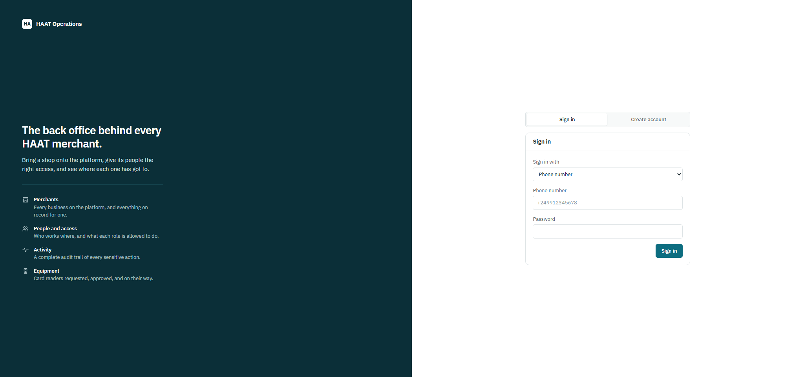

One sign-in for everybody. Three ways to identify yourself — **phone number**, **username**
or **email** — because the platform has three kinds of account and they do not all have
the same things:

- A **merchant owner** signs up with their phone and is verified by a one-time code.
- An **employee** the merchant creates has no phone number at all. Their employer gives
  them a username and a generated password, and the platform forces them to replace that
  password the first time they sign in. A password their employer has read is not a
  password.
- An **email address** can be attached to any account, but it has to be proved with a code
  before it can be used to sign in. An unproved address is worth nothing as a credential.

If two-factor is switched on, the password step returns a *challenge* rather than a
session — and that challenge cannot be used as a credential. The account is not signed in
until the second factor is answered.

**Point worth making to the client:** a wrong password and an unregistered phone number
produce the *identical* response. That is deliberate. If they differed, anyone could
discover which numbers are registered on HAAT by trying them.

---

## 2. What the navigation tells you

Look at the left rail in any screenshot below. It is in three groups, and the grouping is
the whole security model made visible:

| Group | Who sees it | What it covers |
| --- | --- | --- |
| **Platform** | Syber staff only | Merchants, Verification, Activity — reads across *every* business |
| **My own business** | Anybody with a business | Dashboard, Business, Documents, Team, Access, Equipment — only *their* business |
| **Account** | Anybody signed in | Security, System — their own account |

A shopkeeper signing in **does not see the Platform group at all**. Not greyed out —
absent. That matters: a link that is visible and always answers "forbidden" teaches
somebody that the console is broken, when in fact it is working exactly as intended.

And this is not merely hidden in the interface. Every one of those platform routes is
refused by the server for an account below platform reach. Hiding the link is a courtesy;
the refusal is the security.

---

## 3. Dashboard — where a merchant has got to

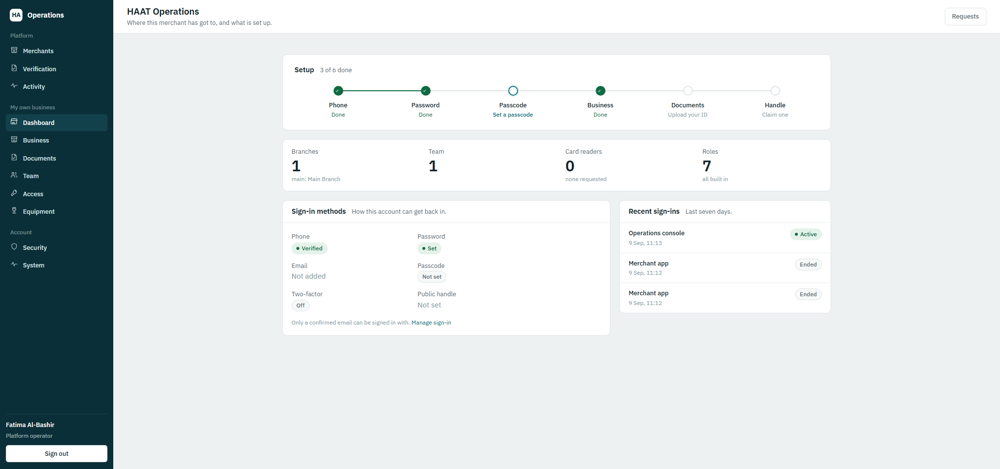

The readiness track across the top is the page, deliberately. HAAT's whole first act is
getting a shop from "a phone number" to "taking payments", and that sequence is the one
thing everybody wants the state of — the owner, the operator, and the person being shown
the product.

Six steps: **Phone · Password · Passcode · Business · Documents · Handle.** Each one is
either done, or it says *what to do about it* rather than merely that it is unfinished.
In this screenshot, three are done and "Documents" says **"Upload your ID"**.

**Two things to demonstrate live:**

1. **An unfinished step is a link.** Clicking "Documents — Upload your ID" takes you to
   the Documents page and scrolls to the exact panel where that gets done. Clicking
   "Passcode — Set a passcode" goes to Security and lands on the passcode panel. A
   checklist that tells you something is missing and then leaves you to find it is only
   half a checklist.
2. **The connector line between two steps is only green when both ends are done.** These
   steps are not finished in strict order — a business can be registered before a passcode
   is set — so a line drawn forward from any completed step would claim progress through
   steps that are still outstanding.

Below the track: counts for the business (branches, team, card readers, roles), the
sign-in methods on the account, and the last seven days of sign-ins with which are still
active.

---

## 4. Merchants — every business on the platform

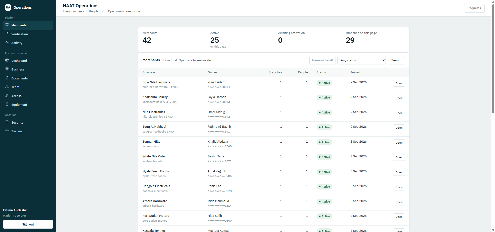

*Platform reach only.*

The home of the console for anybody operating the platform, and deliberately a **list
rather than a summary**. An operator arrives either looking for one particular business —
because somebody has phoned about it — or scanning for the ones that need attention. A
row of totals answers neither.

Each row carries what an operator scans before deciding to open one: the trading name and
handle, the owner and a number to call them on, how many branches and how many people,
the status, and when they joined.

**Filtering** — the CEO's "merchant filtering" — is the three controls at the top right:
free text over the trading name *and* the handle (because an operator is given whichever
one the merchant quoted), plus status and category. Paged at twenty-five.

**Note the masked phone numbers.** `*********8042`. The full number is never sent to this
screen, and not because the interface hides it: the platform stores mobile numbers
encrypted, decrypts them only inside the service that owns them, and masks before the
number crosses the network. Nobody looking at browser traffic sees a customer's phone
number.

---

## 5. One merchant, opened up

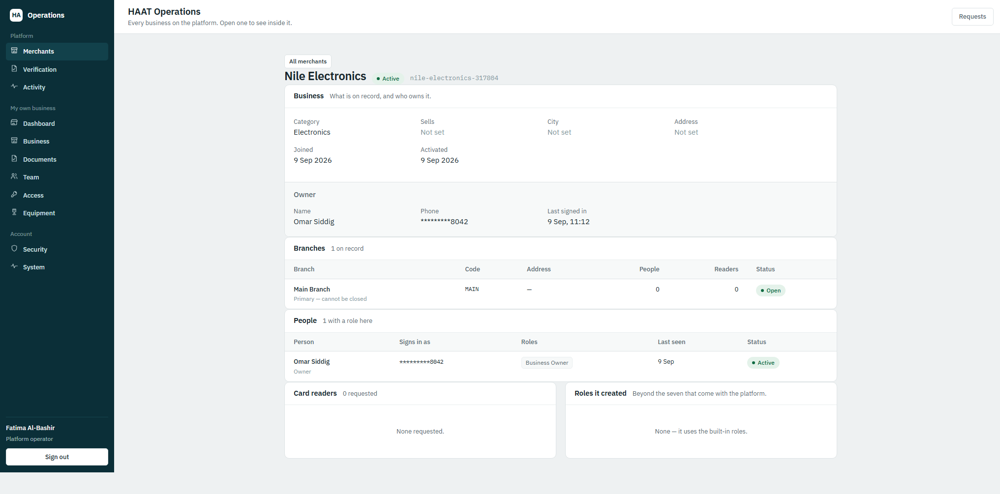

*Platform reach only.*

This is the read that turns a list into a console, and it is worth explaining why it was
not free.

Every other read in the platform derives the business from the caller's own token — which
is exactly right for a merchant and useless for an operator. It meant the platform could
list its merchants and then *not open one*. This endpoint names the business explicitly,
which is precisely why it is platform-only: it is the read that lets somebody look inside
a business that is not theirs.

On one screen: what is on record for the business, the owner and when they last signed in,
every branch with its code and how many people sit at it, everybody who holds a role there
and which roles, the card readers requested, and any roles the business has created for
itself beyond the seven built-in ones.

---

## 6. Verification — the review queue

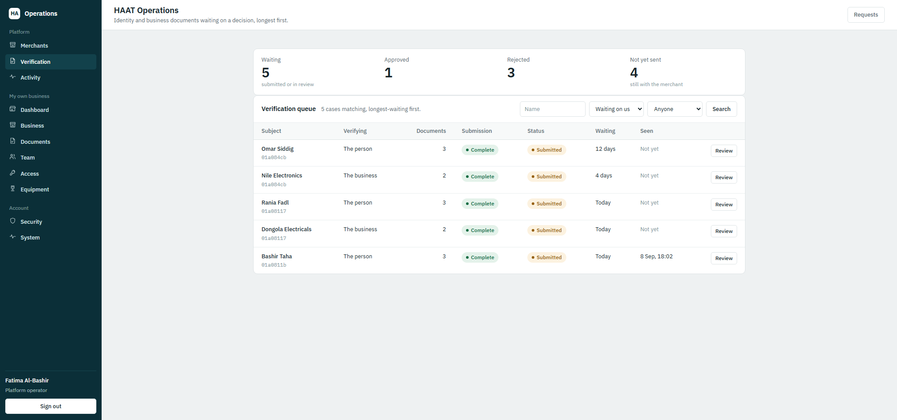

*Platform reach only. This is the CEO's "document review".*

Four tiles, then the queue. The tiles count the whole platform, not the page — asked for
five when there are two hundred is worse than not asking.

**Ordered by how long each case has been waiting, longest first.** This is the single most
important design decision on the page. The failure mode of a review queue is not that it
is slow; it is that one case sinks to the bottom and nobody ever reaches it. Notice the
top row has been waiting **12 days**, the next **4 days**, then everything from today.

Reading the columns:

| Column | What it is for |
| --- | --- |
| **Subject** | The person or the business, by name — a queue of ids is a queue nobody can work |
| **Verifying** | "The person" (KYC) or "The business" (KYB). One merchant produces both |
| **Documents** | How many files are attached |
| **Submission** | Whether it meets the requirements — an operator can see an incomplete case before opening it |
| **Status** | Submitted, In review, Approved, Rejected |
| **Waiting** | In days, not as a date. "12 days" reads as a problem; "28 Aug" makes you do arithmetic |
| **Seen** | When anyone in the back office last opened a document on it — **this is how two operators avoid reviewing the same case twice** |

The filters: search by name, status (defaulting to *"Waiting on us"*, because that is what
an operator means by "the queue"), and person-or-business.

---

## 7. One case, under review

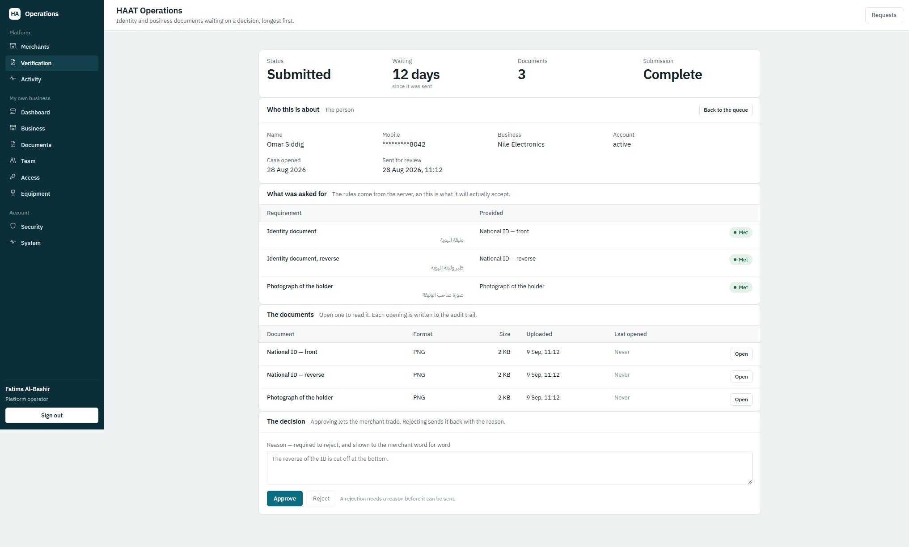

The screen where a person decides whether a merchant may trade. Four panels, in the order
the decision is actually made.

**Who this is about** — the identity being proved, with the number masked, and the
business it belongs to. On the same screen as the documents, so nobody has to hold a name
in their head while switching tabs.

**What was asked for** — the requirements, and which document satisfied each. Labelled in
both English and Arabic.

> **The most important sentence on this page** is the note beside that heading: *"The rules
> come from the server, so this is what it will actually accept."* The console does not own
> the rules. It renders them. If the console carried its own copy of "you need both sides
> of your ID", the two would eventually disagree, and a merchant would be told they were
> finished at the exact moment the server refused them.

**The documents** — as metadata only: kind, format, size, when uploaded, when last opened.
**No file bodies.** They are fetched one at a time, and not for speed — because opening one
is *recorded as somebody having viewed it*. A page that quietly loaded all five would write
four false entries into the audit trail every time an operator glanced at a case.

**The decision** — approve, or reject with a reason.

---

## 8. Opening a document

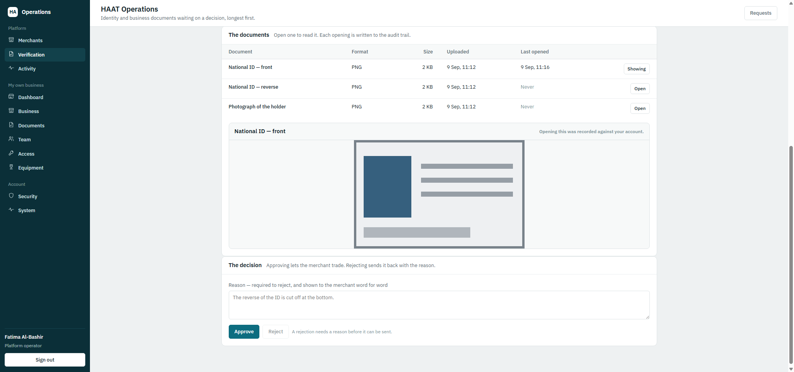

Press **Open** on a row and the document appears below the table, decrypted, large enough
to read. Three things happened in that one click, and all three are worth saying:

1. **The file was decrypted on demand.** It is not stored in a readable form anywhere. Each
   document has its own encryption key; that key is itself encrypted with the platform's
   master key and kept in the database, while the encrypted file body is kept in the
   document store. Neither is worth anything without the other.
2. **The view was recorded.** Note the line in the panel header: *"Opening this was
   recorded against your account."* And the **Last opened** column for that row has changed
   from "Never" to a timestamp. Opening somebody's national ID is an act in its own right,
   and it is in the audit trail with the name of whoever did it.
3. **The image is bounded and letterboxed, never cropped.** A national ID cut off at the
   edge is exactly the fault a reviewer is checking for, so the viewer must not introduce
   one of its own.

The file is served marked `no-store`, so an identity photograph does not survive in a
browser or proxy cache after the operator closes the screen. And the decrypted copy the
browser holds is released the moment they navigate away.

---

## 9. The decision, and what a decided case looks like

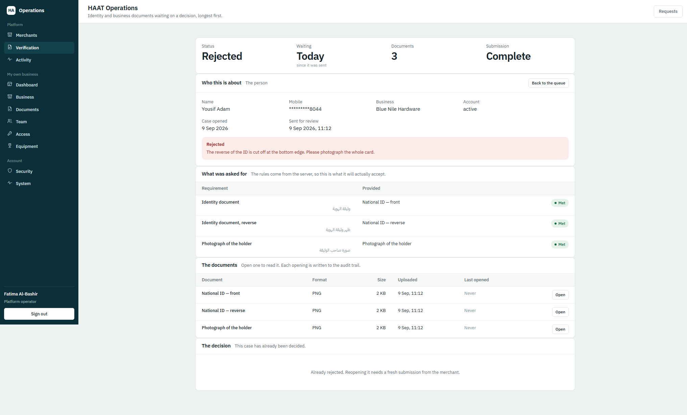

This case was rejected. Four things to notice:

- **The reason is shown in red at the top,** and the merchant sees those exact words.
  Rejecting requires a reason — the Reject button stays disabled until one is typed. A
  refusal with no reason gets resubmitted unchanged, forever.
- **The decision panel now offers nothing.** *"Already rejected. Reopening it needs a fresh
  submission from the merchant."* An operator cannot revisit a decision the merchant has
  already been told the outcome of. The server enforces this too — the console simply does
  not offer a button that would be refused.
- **The documents are still there and still openable.** A decision has to remain auditable
  after it is made.
- **The rejection reopens the case for the merchant.** Which is the point of recording a
  reason: they can act on it. See the next screen.

Approving is the same shape, in green, and the merchant's own page then reads "Approved".

**The audit entry for a decision is written in the same database transaction as the
decision itself** — not best-effort like most audit entries. An approval with no record of
who made it is the one entry that cannot be allowed to go missing, because it is the entry
a regulator asks for by name.

---

## 10. Documents — the merchant's own side

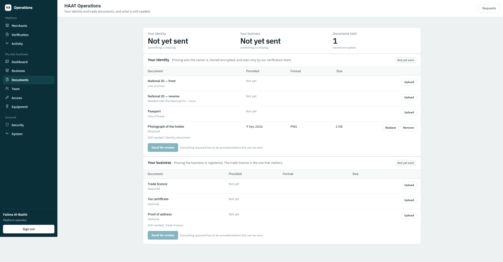

*Any business owner. This is the CEO's "file uploads".*

The same console, the same person signed in — but this is the merchant's own page, and it
is the other half of everything above. Two panels, because **identity and business are two
separate cases**: the owner's identity is proved with an ID and a photograph, the business
with its trade licence, and either can be approved while the other is still waiting.
Collapsing them would mean showing one status for two different things.

Each row is a document, with what it currently is and a button to change it. Read the
sub-labels carefully, because they are doing precise work:

| Label | Meaning |
| --- | --- |
| **One of these** | A national ID *or* a passport. Either satisfies it — you do not need both |
| **Needed with the National ID — front** | The reverse side. Not required yet, and it becomes required the moment a front is uploaded. A passport holder is never asked for it |
| **Required** | There is one way to satisfy this, and this is it |
| **Optional** | Genuinely optional — a tax certificate, a proof of address |
| **Alternative** *(not shown here)* | This would satisfy a requirement that something else already has |

Below each panel: **"Still needed: Identity document."** Named, not counted. A merchant
told only that their submission is "incomplete" has to guess, and they will guess the
documents they have already sent.

**"Send for review" is disabled until everything required is there**, with the reason
beside it. Offering a button that the server would refuse produces a failure the merchant
reads as a fault in the app.

The other states this page shows:

- **With our team** — once sent, the panel says so and the upload buttons disappear. The
  documents cannot be changed while somebody is reviewing them.
- **Sent back to you** — after a rejection, the operator's reason appears in red, the
  upload buttons return, and the merchant can replace what was wrong and send it again.
- **Approved** — in green, with the date.

**On the tile: "Documents held — 1 — stored encrypted."** The merchant is handing over a
photograph of their face and their national ID. Being told plainly what happens to it is
the least they are owed.

---

## 11. Activity — the audit trail

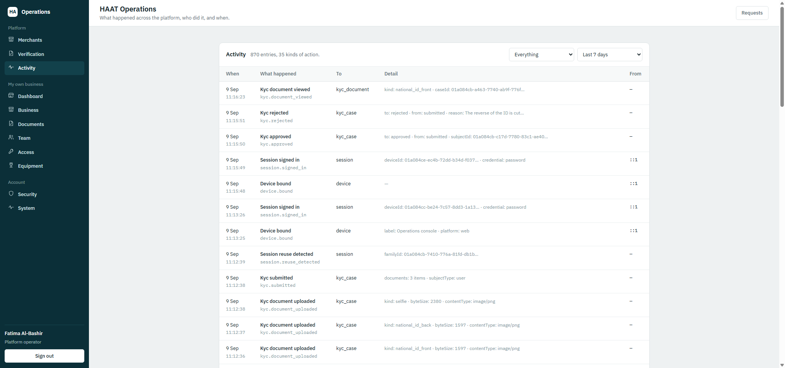

*Platform reach only.*

Every sensitive action on the platform, newest first, with who did it and what changed.
**870 entries across 35 kinds of action** in this screenshot.

Read down the list and you can see the entire verification flow that produced the screens
above, in order:

```
kyc.document_viewed    kind: national_id_front · caseId: 01a084cb…
kyc.rejected           to: rejected · from: submitted · reason: The reverse of the ID is cut…
kyc.approved           to: approved · from: submitted · subjectId: 01a084cb…
session.signed_in      deviceId: 01a084ce… · credential: password
kyc.submitted          documents: 3 items · subjectType: user
kyc.document_uploaded  kind: selfie · byteSize: 2380 · contentType: image/png
```

Two properties worth stating:

1. **It is append-only.** There is no update and no delete, and the application's database
   user should have no privilege to perform either. An audit trail the application can
   rewrite proves nothing.
2. **No document ever appears in it.** An upload entry records that a document of a
   certain kind arrived, how big it was, and which stored object it became — never the
   file, and never any key material.

Also visible in this screenshot: `session.reuse_detected`. Someone presented a refresh
token that had already been spent, so the platform revoked that entire token family. That
is how a stolen session gets shut down, and it left a record.

The filters offer only the action keys **actually present in the log**, rather than a
hard-coded list somebody has to keep in step with the code.

---

## 12. Access — roles and permissions

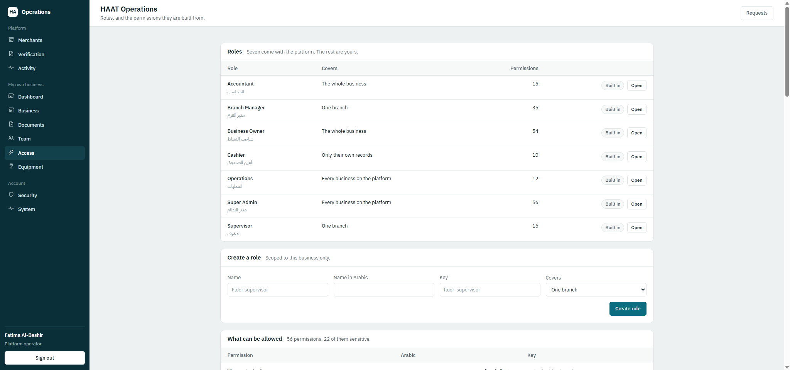

The seven roles PRD §5.11 names, seeded and then immutable: **Super Admin, Operations,
Business Owner, Branch Manager, Supervisor, Accountant, Cashier**. Named in both languages.

The "Covers" column is the part usually missed. A permission says *what* somebody may do;
the scope says *where*:

- **Cashier** — only their own records
- **Branch Manager / Supervisor** — one branch
- **Business Owner / Accountant** — the whole business
- **Operations / Super Admin** — every business on the platform

A Cashier and an Owner both "view transactions". The difference is not the action, it is
how much they see — and modelling that as scope rather than as two separate permissions is
what stops the catalogue doubling every time a role is added.

**56 permissions, 22 of them sensitive.** A sensitive permission is re-verified against the
database on every use rather than trusted from the token, so revoking access takes effect
immediately instead of when the token expires.

A business can **create its own roles** from the same catalogue, scoped to itself. The
seven built-in ones are marked "Built in" and cannot be edited — a "Cashier" whose meaning
varies between merchants is a role nobody can reason about, least of all support.

Two rules to mention if it comes up: an unknown permission in a new role is **refused**
rather than ignored (a typo that silently granted nothing would surface later as a denial
nobody can explain), and a role still held by somebody **cannot be deleted** (cascading
would strip access from people mid-shift).

---

## 13. Team — staff accounts

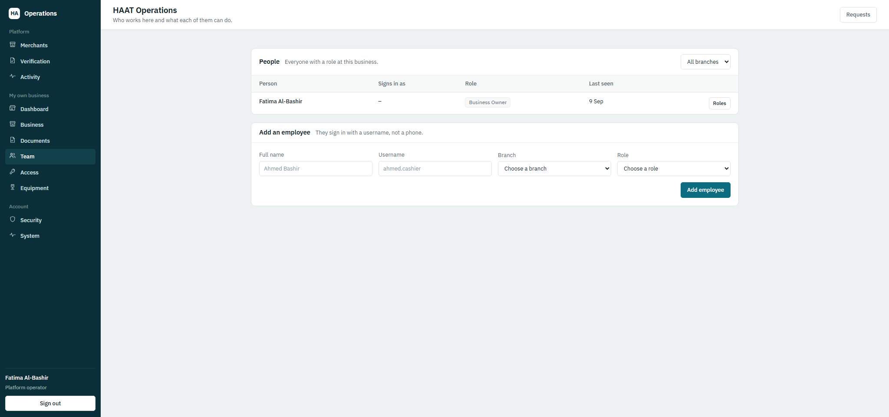

Everyone with a role at this business, and what each of them can do. One row per person
carrying every grant they hold — somebody may be a cashier at one branch and a supervisor
at another, and collapsing that would misrepresent them.

**How much of the team you see comes from the scope on your own roles, not from what you
ask for.** An owner sees every branch and may filter to one; a branch manager sees only
the branches they hold *whatever they request*; a cashier sees themselves.

Adding an employee creates the account, assigns the role at the branch, and returns a
generated password **once**. It is shown on screen and cannot be fetched again — a password
the platform could hand back twice would be one it keeps in readable form. The employee is
required to replace it on first sign-in.

---

## 14. System, and the request inspector

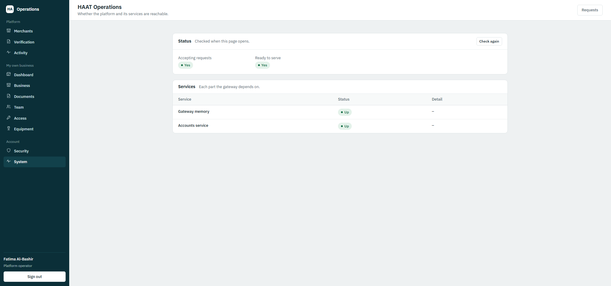

Whether the platform and each service behind it are reachable. The gateway holds no
database of its own by design, so "Accounts service: Up" is a real check across the service
boundary rather than a self-report.

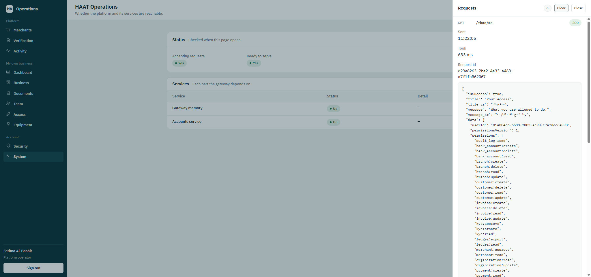

The **Requests** button in the top right of every page opens this. It is the console's own
proof of work, and it is the single most useful thing to open in a technical meeting: it
shows the last fifty API calls the console made, with the complete response exactly as it
arrived.

What one entry shows:

- The method, path, and status — `GET /rbac/me → 200`
- How long it took — 633 ms
- The **request id**, which also appears in the server logs. A support call about "it
  failed at 11:22" becomes one log search rather than a hunt
- The **whole envelope**: `isSuccess`, an English title and message, `title_ar` and
  `message_ar` in Arabic, the `data` payload, and on a failure a machine-readable
  `errorCode` for the client to branch on

Every response on the platform has this shape, success or failure. In this screenshot the
payload is the signed-in account's effective permissions, including `kyc:approve`,
`kyc:create` and `kyc:read` — read live from the database rather than from the token, so it
reflects a change made moments ago.

---

## 15. The complete verification flow, on one page

This is the whole thing end to end. The left column is the merchant in the mobile app or
this console; the right column is Syber in this console.

```
MERCHANT                                          SYBER OPERATIONS

Documents page opens
  → a case is created automatically
    (no "start" button, no "not started" state)

Upload National ID — front
Upload National ID — reverse
  (asked for only because a front was given)
Upload Photograph of the holder
  ↳ each file encrypted with its own key
    before it is stored
  ↳ format read from the file's own bytes,
    not from what the phone claims
  ↳ audit: kyc.document_uploaded

"Still needed: …" until complete
"Send for review" enabled once complete

Send for review ─────────────────────────────────▶ Appears in the queue,
  ↳ audit: kyc.submitted                            ordered by how long it has waited
  ↳ case becomes read-only                          Tiles: Waiting / Approved /
                                                     Rejected / Not yet sent

                                                   Operator opens the case
                                                     ↳ requirements + documents,
                                                       metadata only

                                                   Opens a document
                                                     ↳ decrypted on demand
                                                     ↳ audit: kyc.document_viewed
                                                     ↳ "Seen" column updates so a
                                                       second operator does not repeat it

                                            ┌──────┴───────┐
                                       APPROVE          REJECT (reason required)
                                            │                │
Approved ◀──────────────────────────────────┘                │
  ↳ audit: kyc.approved, in the same                         │
    transaction as the decision                              │
                                                             │
Sent back, with the reason ◀─────────────────────────────────┘
  ↳ audit: kyc.rejected, with the reason
  ↳ case editable again

Replace what was wrong
  ↳ case returns to draft
  ↳ the old refusal is cleared
Send for review ─────────────────────────────────▶ Back in the queue
```

**The two halves are separated by reach, not by subject.** Every merchant-facing route
takes the subject from the signed-in token — there is no field on any of those requests
that could name somebody else's case. Every back-office route names a case explicitly,
which is exactly why all of them refuse anything below platform reach. And they *refuse*
rather than narrow: a review queue quietly filtered down to one merchant looks like an
almost-empty platform, and somebody would act on that.

### What the documents get

| | |
| --- | --- |
| **Envelope encryption** | Each file has its own AES-256-GCM key. That key is encrypted with the master key and kept in the database; the encrypted body goes to the document store. Neither is worth anything alone — and rotating the master key re-wraps thirty-two bytes per document instead of re-encrypting every photograph ever uploaded |
| **A store treated as untrusted** | It receives ciphertext under a bare UUID. No merchant name, no document type, nothing — a listing of the store reveals neither who is verified nor what they submitted. It is a directory today and one adapter away from being object storage, wherever that has to be |
| **Format read from the file** | The type a phone declares comes from a filename and is wrong often enough to matter. The file's own signature is checked, and anything that is not a JPEG, PNG, WebP or PDF is refused at the door — which also turns away a truncated upload that would otherwise reach a reviewer as an image that will not open |
| **A recorded view** | Opening a document is its own audited act, and the response is `no-store` |
| **A checksum** | SHA-256 of the original, verified on every read. Authenticated encryption already proves the file was not tampered with; this proves the store handed back the *right* file, which encryption alone cannot tell you |

This is verified end to end by a script — `npm run verify:kyc` — which uploads files, reads
the store on disk directly, and asserts that what is sitting there is **not** the file that
went in: no recognisable signature, no trace of the original bytes, and filenames that give
nothing away. That assertion cannot be made from an API response, which is why it is a
script rather than a test in the API suite.

---

## 16. What is not in the console yet

Said plainly, because the difference comes up the moment somebody asks to see it.

| | State |
| --- | --- |
| **Merchant transactions** | **Not built.** Blocked on the wallet core API reference from Sharif. This is the only one of the CEO's five console priorities still outstanding, and the blocker is not on our side |
| **Blink as a second opinion on a verification** | Not built, and **not blocking**. A case is decided by a person today, and the columns a provider's answer belongs in are already on the table (`provider`, `providerReference`, `providerOutcome`). The credentials are held by the client and are not needed until the integration is written |
| **QR acceptance, payment links, products and customers** | Deprioritised by the CEO's own console instruction, not forgotten. They have a permission model to declare against and wait on the wallet decision |
| **Deployment** | The console runs locally. It is not hosted anywhere yet, on purpose — it reads every merchant on the platform, so where it lives and who can reach it is a decision to take deliberately rather than by default |

### One open question that needs an answer before it gets expensive

**Do KYC documents have to be stored inside the country?** The store was built so that its
location is a single adapter — moving from a directory to a bucket, in any region, changes
one file and nothing else. But this is the one data set nobody wants to migrate after the
fact, and the answer has to come from the regulator or the banks.

---

*Prepared 9 September 2026. Every screenshot taken from the running console against the
live API on the same day.*
